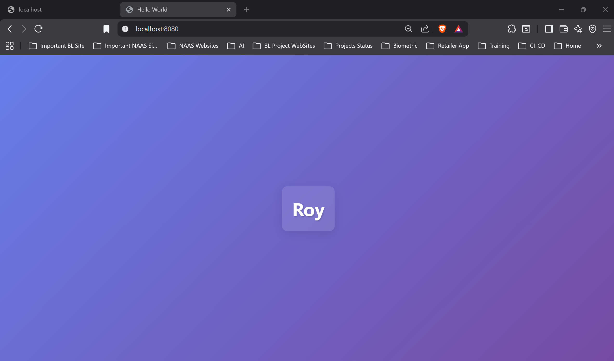
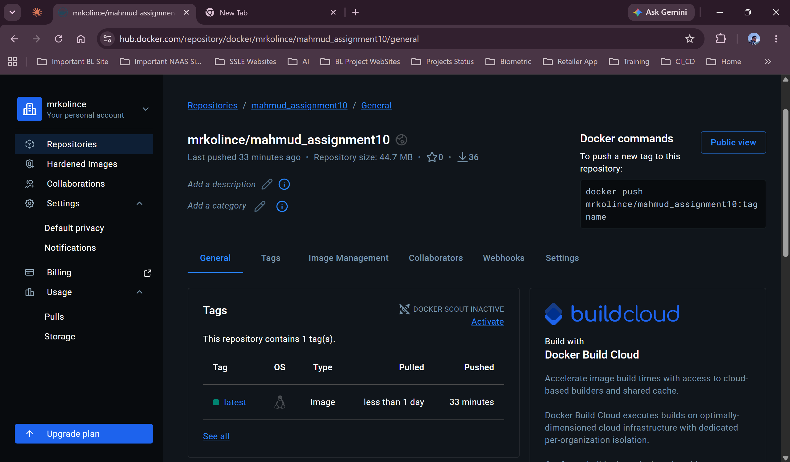

# Assignment 10 — Dockerize & Deploy an Express.js App with Docker Compose + Nginx

> **Module 10 — Mastering DevOps (Batch 11)**
> Containerize a simple Express.js server, publish its image to DockerHub, and run it
> alongside an Nginx container using Docker Compose, exposed on **port 8080**.


---

## 📋 Objective

Take a simple Express.js app and:

1. **Dockerize** the Node.js (Express) app and **push the image to DockerHub**.
2. Create a `docker-compose.yml` that:
   - runs a stock **Nginx** image,
   - **builds and runs** the Express.js app from the `Dockerfile`,
   - starts the Express app **after** Nginx (`depends_on`).
3. **Expose** the application on **port 8080**.
4. Run everything with **Docker Compose**.
5. **Verify** it works in the browser.

---

## 🔗 Links

| | |
|---|---|
| 🐳 **DockerHub image** | https://hub.docker.com/r/mrkolince/mahmud_assignment10 |
| ⬇️ **Pull command** | `docker pull mrkolince/mahmud_assignment10:latest` |
| 📦 **This repository** | https://github.com/MahmudurRahman36/Mahmud_Assignment10 |
| 🌱 **Source app (provided)** | https://github.com/roy35-909/Module-3-deployment |
| 🌐 **App URL (local)** | http://localhost:8080 |

---

## 🏗️ Architecture

```
                    ┌──────────────────────────────────────────┐
                    │              Docker Compose               │
                    │                                           │
  Browser  ──8080──▶│   express-app  (Node 18 + Express)        │
                    │   container port 5000  ◀── EXPOSE 5000    │
                    │        ▲                                  │
                    │        │ depends_on                       │
                    │   nginx-server  (nginx:latest, port 80)   │
                    └──────────────────────────────────────────┘
```

- **nginx-server** — a plain `nginx:latest` image; Compose starts it **first**.
- **express-app** — built from the local `Dockerfile`; host port **8080** maps to
  container port **5000** (where Express listens). It starts **after** Nginx.

---

## 📁 Repository structure

```
.
├── Dockerfile               # Containerizes the Express.js app (Node 18 Alpine)
├── docker-compose.yml       # Defines & wires the nginx + express services
├── DEPLOYMENT_GUIDE.md      # Full step-by-step guide (reproduce from scratch)
├── README.md                # You are here
├── screenshots/             # Screenshots of every step (01–10)
└── submission/              # Compiled PDF documentation
    ├── Assignment10_Mahmud_Docker_Documentation.pdf
    └── Assignment10_Mahmud_Docker_Submission.pdf
```

---

## 🚀 Quick start

> **Prerequisites:** Docker Desktop running, Git installed, a DockerHub account.

```bash
# 1. Clone the app
git clone https://github.com/roy35-909/Module-3-deployment
cd Module-3-deployment

# 2. (Add the Dockerfile and docker-compose.yml from this repo, then…)

# 3. Build the image
docker build -t mrkolince/mahmud_assignment10:latest .

# 4. Push to DockerHub
docker login
docker push mrkolince/mahmud_assignment10:latest

# 5. Run the whole stack
docker compose up -d

# 6. Verify
docker compose ps
#   → open http://localhost:8080
```

To stop and remove everything:

```bash
docker compose down
```

---

## 🐳 The Dockerfile

```dockerfile
FROM node:18-alpine
WORKDIR /app
COPY package*.json ./
RUN npm install --production
COPY . .
EXPOSE 5000
ENV PORT=5000
CMD ["npm", "start"]
```

## 🧩 The docker-compose.yml

```yaml
services:
  nginx:
    image: nginx:latest
    container_name: nginx-server
    restart: always

  app:
    build:
      context: .
      dockerfile: Dockerfile
    container_name: express-app
    ports:
      - "8080:5000"
    environment:
      - PORT=5000
    depends_on:
      - nginx
    restart: always
```

---

## 📸 Step-by-step screenshots

| # | Step | Screenshot |
|---|------|------------|
| 1 | Clone repo & project structure | [`screenshots/01_project_structure.png`](screenshots/01_project_structure.png) |
| 2 | Dockerfile | [`screenshots/02_dockerfile.png`](screenshots/02_dockerfile.png) |
| 3 | docker-compose.yml | [`screenshots/03_docker_compose.png`](screenshots/03_docker_compose.png) |
| 4 | `docker build` | [`screenshots/04_docker_build.png`](screenshots/04_docker_build.png) |
| 5 | `docker push` to DockerHub | [`screenshots/05_docker_push.png`](screenshots/05_docker_push.png) |
| 6 | `docker compose up -d` | [`screenshots/06_docker_compose_up.png`](screenshots/06_docker_compose_up.png) |
| 7 | Verify running containers | [`screenshots/07_docker_ps.png`](screenshots/07_docker_ps.png) |
| 8 | App in browser (localhost:8080) | [`screenshots/08_browser_localhost_8080.png`](screenshots/08_browser_localhost_8080.png) |
| 9 | Image on DockerHub | [`screenshots/09_dockerhub_image.png`](screenshots/09_dockerhub_image.png) |
| 10 | Docker Desktop containers | [`screenshots/10_docker_desktop.png`](screenshots/10_docker_desktop.png) |

### App running on port 8080



### Image published on DockerHub



---

## ✅ Objectives checklist

- [x] Express app **dockerized** (`Dockerfile`)
- [x] Image **pushed to DockerHub** (`mrkolince/mahmud_assignment10:latest`)
- [x] `docker-compose.yml` runs **Nginx** and **builds/runs** the Express app
- [x] Express app starts **after** Nginx (`depends_on`)
- [x] Application **exposed on port 8080**
- [x] Everything run via **Docker Compose**
- [x] **Verified working** in the browser

---

## 👤 Author

**Mahmudur Rahman** — Module 10, Mastering DevOps (Batch 11)

> 📄 Full walkthrough: [`DEPLOYMENT_GUIDE.md`](DEPLOYMENT_GUIDE.md) ·
> PDF: [`submission/Assignment10_Mahmud_Docker_Documentation.pdf`](submission/Assignment10_Mahmud_Docker_Documentation.pdf)
